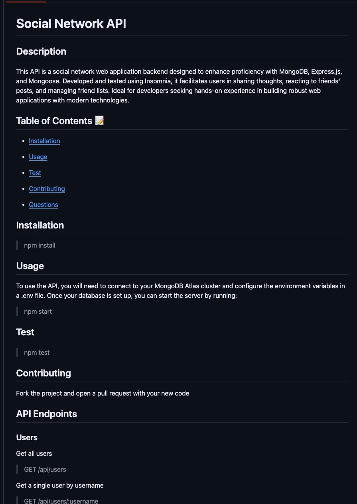

# Hello World! I'm Brandon Kelly 🌍

<h2 style="text-align: center">Principles I Live By<h2>

  <h5>1. There is no knowledge that is not power</h5>
  <h5>2. Docs are your best friend; no one will hold your hand</h5>
  <h5>3. Where's the food?</h5>

 

  <h2>Languages | Web Dev</h2>

  

    
    
    
    
    
    
    
    
    
    
    
    
  

  <h2>Frameworks | Libraries</h2>

  

    
    
    
    
    
    
    
  

  <h2>Technologies | Platforms</h2>

  

    
    
    
    
    
    
    
    
    
  

  <h2>Other</h2>

  

    
    
    
  

   

  

   

## Testing the API endpoints of a social media application I developed using Express.js for routing, MongoDB as the database, and leveraging the mongoose package

## 📬 Let's Connect!

- [🌐 Portfolio](https://brandon-kellys-portfolio.netlify.app/)
- [💼 LinkedIn](https://www.linkedin.com/in/brandon-kelly-367b3730b//)
- [📧 Email](mailto:your.email@example.com)

Thanks for stopping by! Let's create something amazing together!

