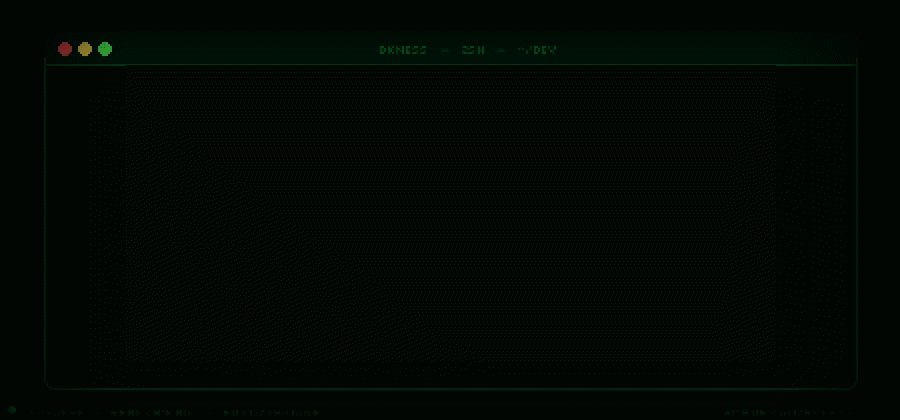
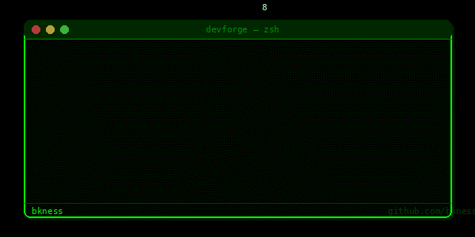
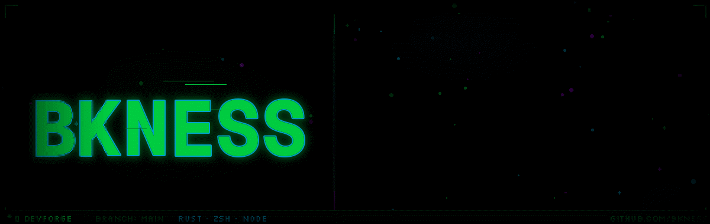
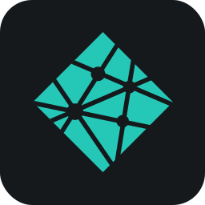
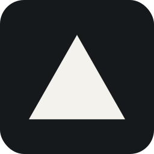
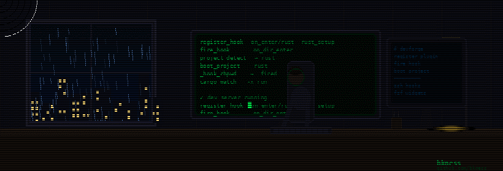

<!-- Online badge -->

  

 

<!-- Opening Stack animated font  -->

 

---

<!-- My personal BIO terminal gif -->
 

  

---

<!-- Opening bio animated text font -->

<!-- Animated svg text BIO -->

---

<!-- Forges-CLI terminal gif -->

  

 

---

<!-- Gifs -->

  

  
  

---

<!-- Socials section -->

# 🌐 Socials:

&nbsp;&nbsp;&nbsp;&nbsp;&nbsp;&nbsp;&nbsp;&nbsp;&nbsp;&nbsp;&nbsp;&nbsp;&nbsp;&nbsp;&nbsp;&nbsp;&nbsp;&nbsp;&nbsp;&nbsp;

---

<!-- Stacks used -->

# 💻 Tech Stack:

&nbsp;&nbsp;&nbsp;&nbsp;&nbsp;&nbsp;&nbsp;&nbsp;&nbsp;&nbsp;&nbsp;&nbsp;&nbsp;&nbsp;&nbsp;&nbsp;&nbsp;&nbsp;&nbsp;&nbsp;&nbsp;&nbsp;&nbsp;&nbsp;&nbsp;&nbsp;&nbsp;&nbsp;&nbsp;&nbsp;&nbsp;&nbsp;&nbsp;&nbsp;&nbsp;&nbsp;&nbsp;&nbsp;&nbsp;&nbsp;&nbsp;&nbsp;&nbsp;&nbsp;&nbsp;&nbsp; &nbsp;&nbsp;&nbsp;&nbsp; &nbsp;&nbsp;&nbsp;&nbsp;&nbsp;&nbsp;&nbsp;&nbsp;&nbsp;&nbsp;&nbsp;&nbsp;&nbsp;&nbsp;&nbsp;&nbsp;&nbsp;&nbsp;&nbsp;&nbsp;

---

<!-- My banner gif -->

  

---

<!-- Profile counter, deployment badges and github stats -->

# 📊 GitHub Stats:

---

 

---

<!-- Headphones / music gif -->

 

 

---

<!-- Another personal banner -->

  

---

<!-- Contribution snake animated text display 🐍 -->
 

---

<!-- Contribution snake gif  -->
<picture>
    <source media="(prefers-color-scheme: dark)"
  srcset="https://raw.githubusercontent.com/bkness/bkness/main/github-snake-dark.svg" />
    <source media="(prefers-color-scheme: light)"
  srcset="https://raw.githubusercontent.com/bkness/bkness/main/github-snake.svg" />
    
  </picture>
   

---

<!-- Pacman contribution gif custom -->
<picture>
  <source media="(prefers-color-scheme: dark)" srcset="https://raw.githubusercontent.com/bkness/bkness/main/github-pacman-dark.svg?v=1" />
  
</picture>

---

<!-- Mario gif -->
 

 

---

<!-- Youtube video testing social media API I made  -->

### Social Media API

A RESTful API built with **Express.js** and **MongoDB/Mongoose** — full CRUD for users,
thoughts, and reactions. Designed to mirror the data demands of a real social platform.

---

<!-- Contact and donate section with a ridiculous wall of nbsp for spacing -->

 

&nbsp;&nbsp;&nbsp;&nbsp;&nbsp;&nbsp;&nbsp;&nbsp;&nbsp;&nbsp;&nbsp;&nbsp;&nbsp;&nbsp;&nbsp;&nbsp;&nbsp;&nbsp;&nbsp;&nbsp;&nbsp;&nbsp;&nbsp;&nbsp;&nbsp;&nbsp;&nbsp;&nbsp;&nbsp;&nbsp;&nbsp;&nbsp;&nbsp;&nbsp;&nbsp;&nbsp;&nbsp;&nbsp;

## 💰 You can help me by Donating  

