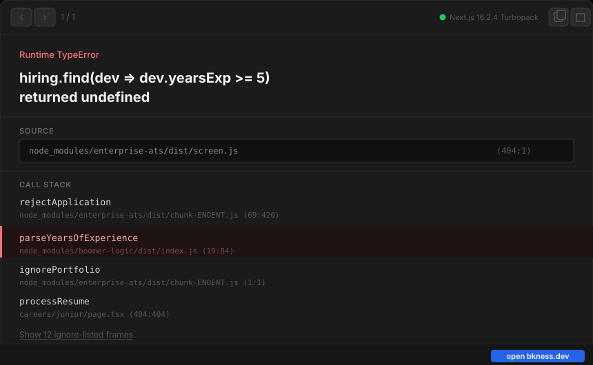
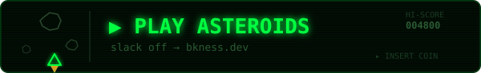
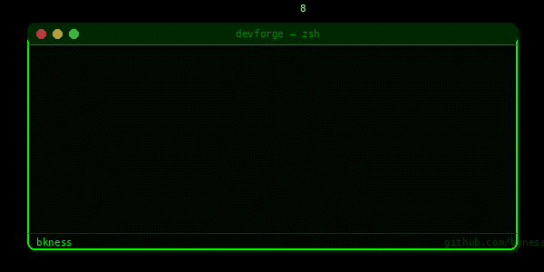

  <a href="https://www.weballtech.com">
     dev.yearsExp >= 5) returned undefined" />
  </a>

  

 

<!-- forged-cli badges — npm publish + gist action signals -->

  
  &nbsp;
  
  &nbsp;
  
  &nbsp;
  

 

<!-- Asteroids bait — links to portfolio terminal where slack off launches the game. -->

  
  

 

 

 

<!-- forged-cli terminal demo -->

  

 

<!-- Contribution graphs — Actions/cron/token knowledge -->
<picture>
  <source media="(prefers-color-scheme: dark)" srcset="https://raw.githubusercontent.com/bkness/bkness/main/github-snake-dark.svg" />
  <source media="(prefers-color-scheme: light)" srcset="https://raw.githubusercontent.com/bkness/bkness/main/github-snake.svg" />
  
</picture>

<picture>
  <source media="(prefers-color-scheme: dark)" srcset="https://raw.githubusercontent.com/bkness/bkness/main/github-pacman-dark.svg?v=1" />
  
</picture>

 

<!-- Stats -->

 

<!-- Socials -->

&nbsp;&nbsp;&nbsp;&nbsp;

